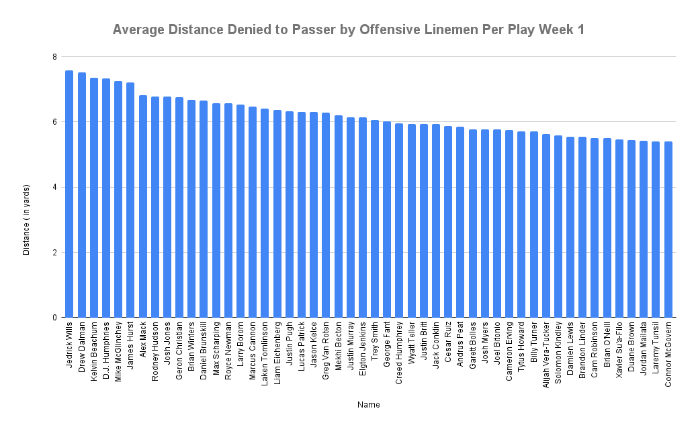

# NFL Big Data Bowl 2023
Project by Sam Oliver

## Overview
The National Football League (NFL) is back with another Big Data Bowl, where contestants use Next Gen Stats player tracking data to generate actionable, creative, and novel stats. Previous iterations have considered running backs, defensive backs, and special teams, and have generated metrics that have been used on television and by NFL teams.

## 2023 Theme: Linemen on Pass Plays
Quarterbacks may get the glory, but some of the most important work takes place a few feet in front of them. The offensive line protects the passer, providing precious seconds to find receivers downfield. At the same time, the opposing team’s defensive line attempts to find a disruptive path. If a defender sneaks through, it can mean a sack, a blocked pass, or even a turnover. Some of the game’s most important plays happen on the line and this competition examines the data behind the hardest workers in football.

## New Metric Proposal: Distance Denied to the Passer

It's notoriously difficult to grade offensive linemen, and the [-2.0 to 2.0](https://www.pff.com/news/pro-how-we-grade-offensive-and-defensive-linemen) scale seems a bit odd and subjective. Distance denied to the passer is fairly self explanatory. It basically describes the amount of distance between the offensive lineman and the passer left when a play is made assuming that the lineman is blocking or has blocked a player on the play. This metric is describing how much distance a specific lineman was able to deny to the pass rusher that he blocked. Instead of using an unspecific point scale for grading offensive linemen on pass plays, a metric, "Distance Denied", can be used to easily evaluate and compare linemen to each other.

This project defines Distance Denied to the Passer for plays in which the passer does not scramble, and it only calculates this distance on plays in which a forward pass is made or the quarterback is sacked. A lineman's Distance Denied to the Passer is set to zero if the passer is sacked or hit on the play. When the passer throws the ball, the Distance Denied to the Passer is calculated as the distance between the blocker and the passer (assuming the blocker did make a block on the play) or the distance between the pass rusher and the passer if the blocker was beaten on the play. The distance that is calculated results from the distance formula between the passer and the blocker (or pass rusher in the cases of the blocker being beaten). This distance is calculated using the NFL's Next Gen Stats data that includes data that tracks players on a coordinate system.

## The Data
The data for this project includes the NFL’s Next Gen Stats data (>1M data points per week), including player tracking, play, game, and player information, as well as Pro Football Focus (PFF) scouting data for 2021 passing plays (Weeks 1-8 of the NFL season). 

## Methods
Multipe R notebooks, accompanied with filtering the data in Google Sheets, were used to clean the data. After merging and cleaning the data throughout several different steps in the whole process, the final metric "Average Distance Denied to the Passer Per Play" was produced. This distance takes the distance denied per offensive linemen and sums it over an entire game and finally divides by the number of plays in which the O-lineman blocked someone during that game. This process was carried out for the first week of data in the dataset, but it could be aggregated across the whole season or across many games with the incorporation of more data.

## Results
The best performing offensive linemen for the week 1 data can be visualized with the chart below. The chart includes the top 50 offensive linemen for week 1 in which more distance denied per play results in a higher ranking than a lower value.

## Future Work
This metric can be aggregated across multiple weeks or whole seasons to evaluate performance of offensive linemen and compare performances across individual players and teams. Distance Denied and the rankings produced by it can also be correlated with other measures of success for offensive linemen and cross-validated with the linemen grading system to understand how well Distance Denied measures performance.
